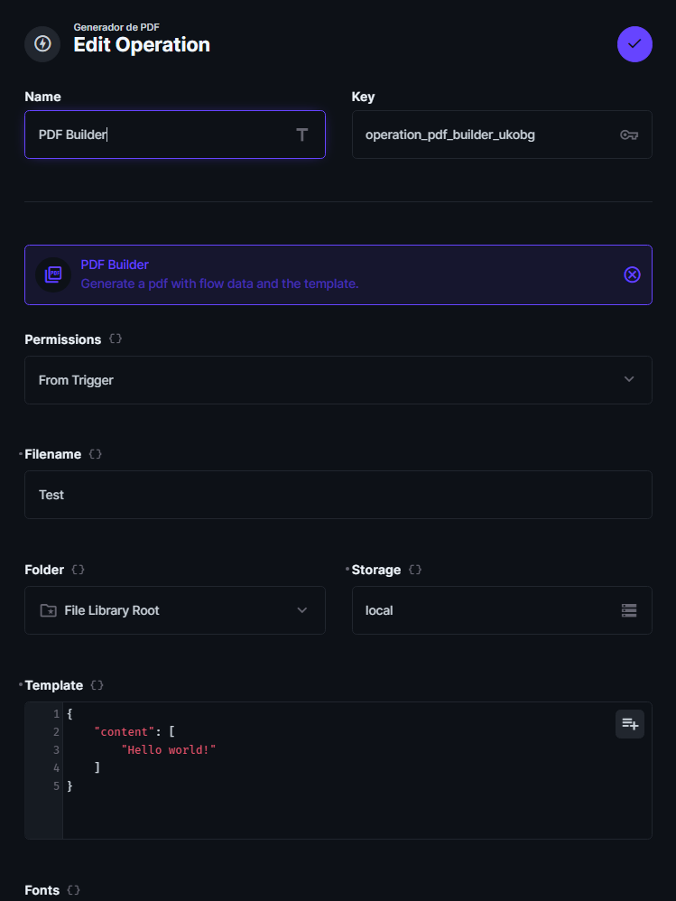
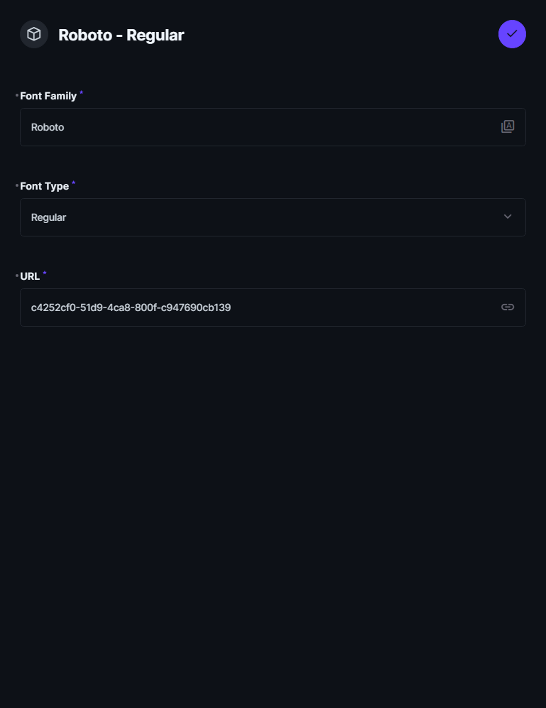

# PDF Builder Operation for Directus

The “PDF Builder Operation” extension for Directus allows automated generation of PDF files using custom JSON templates.
This operation can be integrated within Directus workflows, allowing the creation of highly customized PDF documents.
Use dynamic values extracted from other operations via `operationKey`, such as `{{read_users_collection.first_name}}`,
to customize the PDF content.

# Installation

Refer to the [Official Guide](https://docs.directus.io/extensions/installing-extensions.html) for details on installing
the extension from the Marketplace or manually.

# Features

- 📄 Generate PDF files based on JSON content
- 🔗 Add external fonts via URL
- 🔗 Add internal fonts via UUID
- 📁 Custom file name and path
- 🗂️ Store generated PDF files in Directus

# Usage

Add the `PDF Builder Operation` via the flow builder and configure the operation with the desired settings. The
operation will generate a PDF file based on the provided JSON content.

### General Form View

This view shows the general configuration form for the PDF Builder operation, where you can define the operation key,
permissions, filename, storage, and the JSON template that will be used to generate the PDF.

### Font URL Configuration

In this view, you can configure an external font by providing the URL. Ensure that the URL points to a TTF font file, as
only TTF fonts are supported.

### Font UUID Configuration

This view allows you to select an internal font stored in Directus by using its UUID. The font must be of TTF type, and
the UUID is obtained from the file's URL within Directus.

